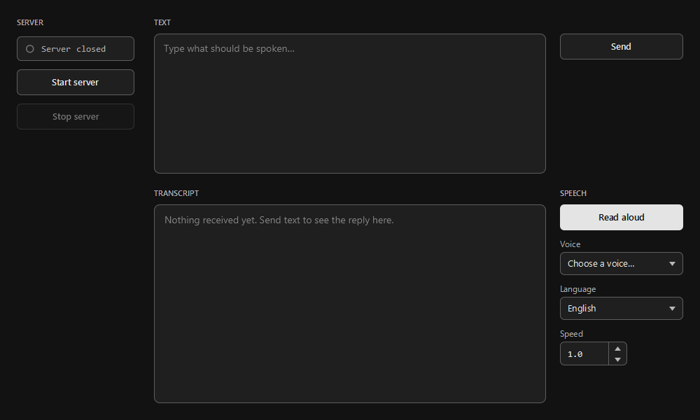
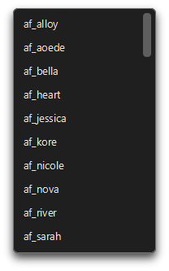
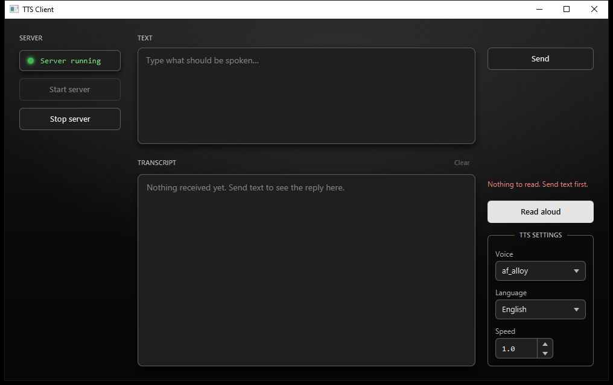

# ttsit-client

A JavaFX desktop GUI for [ttsit](https://github.com/1Ymt/ttsit), the local
Kokoro-82M text-to-speech server. It starts and stops the server for you,
splits the text you paste in into sentences, and streams each one back as
audio while the next is still being synthesized.

## Usage

Click **Start Server** and wait for the status lamp to turn green (this launches
the local `ttsit` process for you). Type or paste text into the **Text** box and
hit **Send** to move it into the transcript. Pick a **voice**, **language** and
**speed** on the right, then click **Read Aloud**: the transcript is split into
sentences and streamed back as audio one sentence at a time, so playback starts
before the whole text has finished synthesizing. Trying to read aloud before
the server is running, or with an empty transcript, shows a hint explaining
what to do instead of silently doing nothing. Use **Stop Server** when you're
done.

| | |
|---|---|
|  |  |
|  | |

## Setup

Requires JDK 21 (a Maven wrapper is included, no separate Maven install
needed) and a working [ttsit](https://github.com/1Ymt/ttsit) checkout, since
this app launches it as a subprocess.

```
git clone --recurse-submodules https://github.com/1Ymt/ttsit-client.git
```

(or, if already cloned: `git submodule update --init`)

Then set up the `ttsit` submodule's Python environment as described in
[its README](https://github.com/1Ymt/ttsit#setup).

## Running

From the `ttsit-client` directory:

```
mvnw.cmd javafx:run      # Windows
./mvnw javafx:run        # Linux/macOS
```

## License

MIT - see [LICENSE](LICENSE).
